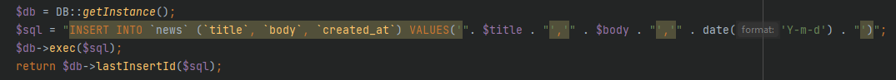

# PHP test

## 1. Installation

- Create an empty database named "phptest" on your MySQL server
- Import the dbdump.sql in the "phptest" database
- Execute this command  `cp .env.example .env` to create a .env file based on env.example
- Put your MySQL server credentials in the `.env` file
- You can test the demo script in your shell: "php index.php"

## 2. Documentation

The modification I made on this system focused on how the system can easily be implemented,
maintained, scaled, and easier to understand by any developer who will handle this system.

**System Design Pattern**  
I used the System design pattern we called Service Layer with Repository Pattern.
Service Layer act as a collection of different services that process business logics.
The Repository Pattern will act as a model that handles on retrieving and
manipulating data from our database. As a result, this will be a maintainable and highly scalable system.

Basic structure example:
                                
      Client Side                 Service Layer                   Repository Layer            
                                (Buseness Logics)                     (Model) 
            
    News List <----------------- NewsService.php <------------- NewsRepository.php           
                                     /  |\                               \
                                    /   |                                 \
    News w/ Comments <-------------     |                                  <------------ DATABASE
                                        |                                 /         
                                        |                                /
    Comments List <----------- CommentService.php <----------- CommentRepository.php     

These are the list of the issue that I encountered and how I handled these bad practices/issues

|No.|Issue|Solution|Explanation|
|---|---|---|---|
|1||| Proper folder structure implementation for maintainability.|
|2|   |   |  Proper naming of methods of CRUD, we can use list/index,create,update,delete since we are already on a Service Layer file. |
|3|   |   | Proper code blocks, Description, Parameters and Return with data types indicated is better.  |
|4|   |   | Repetitive declaration of method, We can use Traits for single implementation then use if necessary.    |
|5|   |   |  Sensitive information and credentials should **not** be hardcoded, We can create a separate file that can be use to store all credentials and information. |
|6|   |   | This is the solution on number 5, We can implement an .env file to solve security issue and proper handling of information.  |
|7|   |   |  Simple CRUD functionalities without extra operation can be implemented and used by multiple Model. I put some of the general methods (CRUD) into Inheritance Class to avoid repetitive of implementation of method, and, of course, maintainability!|
|8|  | | Assigning of datatype on return value. |
|9|  | | It seems that this 2 method are doing the same functionality with limited capability because of the parameters they accept. For the solution, I created a method that can support not only 2 of them but any other new Model. This can handle any number of columns that can be inserted by just providing proper information. This is totally safe since this will filter unknown columns before we insert.|
|10|  | | Proper declaration and initialization can prevent multiple instance, and less code. |
|11|  | | Improper handling of data on sql query may lead to SQL Injection. I modified the execution process by following the proper SQL execution with data. |
|12|  | | Improper looping of whole data repeatedly then just to compare and show is a process that we should avoid specially on a large data. The solution is to create a method that will accept an id to show limited data. Less process, less data. |
|13|  | | Proper initialization of autoload files for clean code. I didn't install an autoload for composer package for easier installation. But of course we can install composer here to install different package such as Dotenv\Dotenv. |
|14|  | | This can be set as constant. |
|15|  | | We can put our name and/or date as an author if we are the one who created the file. But of course this will still depends on your coding rules.|

